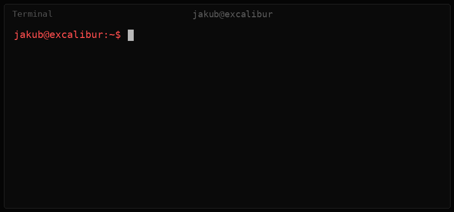

<div align="center">



<br>

`jakub@excalibur:~$ whoami`

### Cybersecurity Student · Aspiring Penetration Tester

<br>


</div>

<br>

## `cat about.txt`

```text
Cybersecurity student at the University of Bradford, working towards
a career in penetration testing.

Interests: web application security, Linux, reverse engineering,
and security automation.

I like understanding how things work.
I like understanding how things break even more.
```

<br>

## `cat focus.txt`

| Core Focus | Currently Learning |
|---|---|
| Web application security | Active Directory / Windows |
| Penetration testing | Python security automation |
| Linux internals | Reverse engineering |
| Security automation | Networking fundamentals |

<br>

## `ls -la ~/projects`

| Project | Description | Status |
|---|---|---|
| [`attack-surface-monitor`](https://github.com/jakubraczylo/attack-surface-monitor) | Python tool that watches a domain for new subdomains, open ports and TLS certs, and alerts to Discord when something changes | 🚧 In progress |

<br>

## `neofetch`

```text
              .--.                         jakub@excalibur
             |o_o |                        ----------------
             |:_/ |                        OS: Pop!_OS 24.04 LTS
            //   \ \                       Shell: bash
           (|     | )                      Languages: Python · Java · C++ · C#
          /'\_   _/`\                      Focus: Offensive Security
          \___)=(___/                      Interests: Web Security · RE
```

<br>

<div align="center">

## `./contact`

[](https://github.com/jakubraczylo)
[](https://www.linkedin.com/in/jakub-raczylo/)

</div>

<br>

```text
jakub@excalibur:~$ sudo ./secret
[sudo] password for jakub:
Permission denied.
Nice try.
```
